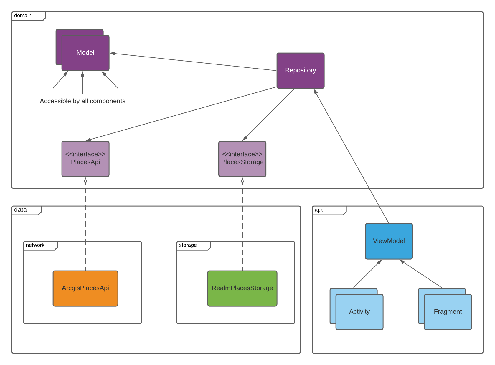
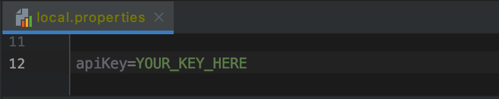

# GetUpsideTest

Android application which will show nearby food places as pins on the Google Maps. List of all found places also should be available for display. Tapping on a map pin or clicking list item should show place details.

Test task for Android Developer position at GetUpside

### General Project structure:

### Google maps key

Before you run your application, you need a Google Maps API key.

To get one, follow this (link)[https://console.developers.google.com/flows/enableapi?apiid=maps_android_backend&keyType=CLIENT_SIDE_ANDROID&r=B9:3D:71:F7:18:F0:B5:73:FB:63:22:06:56:20:82:8F:30:30:AF:7B%3Bcom.givenocode.getupsidetest], follow the directions and press "Create" at the end

You can also add your credentials to an existing key, using these values:

Package name:
`com.givenocode.getupsidetest`

SHA-1 certificate fingerprint:
`B9:3D:71:F7:18:F0:B5:73:FB:63:22:06:56:20:82:8F:30:30:AF:7B`

Alternatively, follow the directions (here)[https://developers.google.com/maps/documentation/android/start#get-key]

Once you have your key (it starts with "AIza"), set it to apiKey property in local.properties file

### Runtime permission handling

app uses experimental feature registerForActivityResult from `androidx.activity:activity-ktx:1.2.0-alpha04`

### Device location

current implementation only gets lastLocation. it may not work in case if location was not requested by any app before. This may be fixed by going to google maps so that it requests location.

